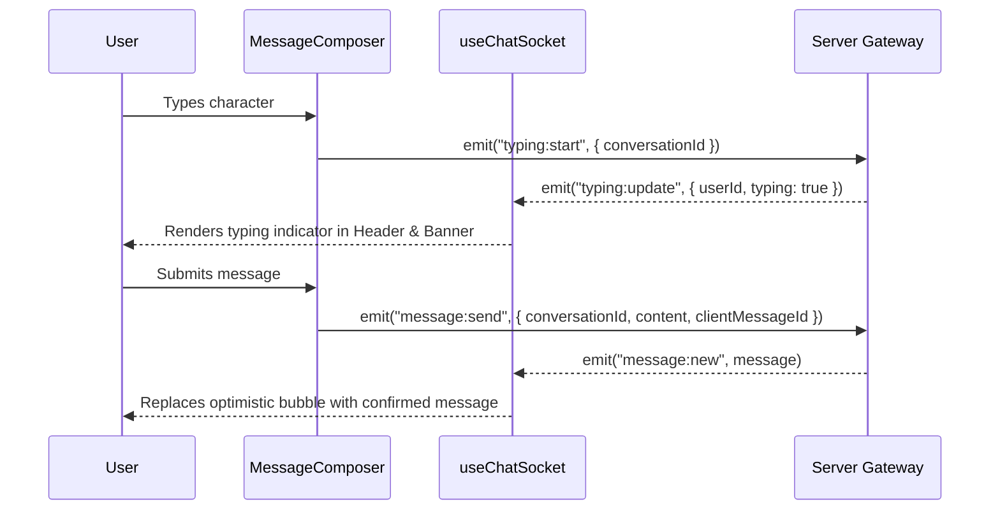

# Frontend Application — GrekMessenger

React 18 single-page application built with Vite, TailwindCSS, and Socket.IO client, adhering strictly to a **Container / Presentational ("Dumb") Component** architecture.

---

## 1. Setup & Run Instructions

### Prerequisites
- Node.js (v18+)
- Backend running on `http://localhost:5000`

### Environment Configuration
Create `client/.env`:
```env
VITE_API_URL=http://localhost:5000/api
VITE_SOCKET_URL=http://localhost:5000
```

### Installation & Execution
```bash
# 1. Install dependencies
npm install

# 2. Start development server (with hot-module reloading)
npm run dev

# 3. Build production bundle
npm run build
```

The app will be available locally at `http://localhost:5173`.

---

## 2. Component Architecture (Container vs. Dumb Components)

To maintain clean separation of concerns and high testability, the frontend separates stateful data operations from presentational rendering:

```
[Pages / Containers]
 (e.g. Chat.jsx, Login.jsx)
        │
        ├── Holds route state, manages top-level drawers/modals
        └── Connects to Custom Hooks
                 │
                 ▼
         [Custom Hooks Layer]
  (useChatMessages, useChatSocket, useGroupActions,
   useUserSearch, useMessageComposer)
        │
        ├── Encapsulates API requests, abort signals, debounce
        └── Manages Socket.IO listeners and timers
                 │
                 ▼
     [Dumb / Presentational Components]
 (MessageList, MessageComposer, MessageItem, UserSearch,
  GroupInfo, GroupMemberList, AddMemberModal, CreateGroupModal)
        │
        ├── Zero direct API or Socket imports
        └── Purely driven by props and event callbacks
```

---

## 3. Custom Hooks Reference

| Hook | File | Responsibility |
| :--- | :--- | :--- |
| `useChatMessages` | [`hooks/useChatMessages.js`](file:///f:/GrekMessenger/client/src/hooks/useChatMessages.js) | Keyset pagination, loading states, optimistic message dispatch, and retry handling. |
| `useChatSocket` | [`hooks/useChatSocket.js`](file:///f:/GrekMessenger/client/src/hooks/useChatSocket.js) | Real-time event subscriptions (`message:new`, `message:receipt`, `typing:update`, `reaction:updated`), room joining, and auto-sync. |
| `useMessageComposer`| [`hooks/useMessageComposer.js`](file:///f:/GrekMessenger/client/src/hooks/useMessageComposer.js)| Draft state, textarea auto-resizing, typing emission throttling, and 1.5s stop timer. |
| `useGroupActions` | [`hooks/useGroupActions.js`](file:///f:/GrekMessenger/client/src/hooks/useGroupActions.js) | Group mutations (name/avatar update, member add/remove, role promote/demote, ownership transfer, delete group). |
| `useUserSearch` | [`hooks/useUserSearch.js`](file:///f:/GrekMessenger/client/src/hooks/useUserSearch.js) | User search with 300ms debounce, cursor pagination, and cancellation flags. |

---

## 4. Real-Time Synchronization Lifecycle



### Auto-Reconnection & Resubscription
When the network drops or the socket reconnects:
1. `SocketProvider` automatically refreshes the JWT access token if expired.
2. It reconnects and iterates through all active subscriptions registered via `registerSubscription(conversationId, syncHandler)`.
3. It rejoins socket rooms and synchronizes missed messages and read receipts seamlessly.

---

## 5. Known Frontend Limitations & Trade-offs

1. **Client-Side Edit/Delete Window Countdown**:
   - The UI disables the Edit/Delete action buttons after 10 minutes based on client clock comparison with `message.createdAt`. The server remains the ultimate authority via atomic SQL date comparison.
2. **Viewport Intersection Threshold for Read Receipts**:
   - Messages trigger read receipts when at least 60% of the message element is visible in the scroll viewport (`IntersectionObserver threshold: 0.6`). Rapid scrolling past messages marks only the latest visible message to prevent network congestion.
3. **No Local IndexedDB Caching Yet**:
   - Currently, chat history is kept in React state. Refreshing the browser re-fetches the latest page (30 messages) from the REST API rather than reading an offline IndexedDB cache.
