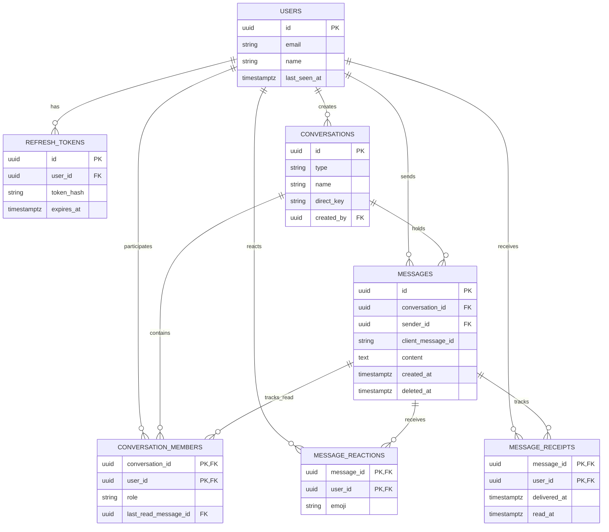

# Database Architecture — GrekMessenger

PostgreSQL schema design, relationships, and indexing strategies optimized for high-concurrency, real-time messaging.

---

## 1. Schema Overview & Entity Relationship Diagram



---

## 2. Table Specifications & Reasoning

### `users`
Core user identity, authentication credentials, and presence tracking.

| Column | Type | Constraints | Description |
| :--- | :--- | :--- | :--- |
| `id` | `UUID` | `PRIMARY KEY DEFAULT gen_random_uuid()` | Universally unique user ID. |
| `email` | `TEXT` | `NOT NULL UNIQUE` | Normalized lowercase email for login. |
| `password_hash` | `TEXT` | `NOT NULL` | Bcrypt password hash. |
| `name` | `TEXT` | `NOT NULL` | Display name. |
| `avatar_url` | `TEXT` | `NULL` | Optional profile image link. |
| `last_seen_at` | `TIMESTAMPTZ`| `NULL` | Updated when user disconnects/transitions offline. |
| `created_at` | `TIMESTAMPTZ`| `NOT NULL DEFAULT NOW()` | Account creation timestamp. |
| `updated_at` | `TIMESTAMPTZ`| `NOT NULL DEFAULT NOW()` | Profile update timestamp. |

---

### `refresh_tokens`
Secure long-lived refresh token rotation storage.

| Column | Type | Constraints | Description |
| :--- | :--- | :--- | :--- |
| `id` | `UUID` | `PRIMARY KEY DEFAULT gen_random_uuid()` | Token record ID. |
| `user_id` | `UUID` | `NOT NULL REFERENCES users(id) ON DELETE CASCADE` | Token owner. |
| `token_hash` | `TEXT` | `NOT NULL` | SHA-256 hash of the refresh token string. |
| `expires_at` | `TIMESTAMPTZ`| `NOT NULL` | Token expiration date (typically 7 days). |
| `revoked_at` | `TIMESTAMPTZ`| `NULL` | Timestamp when revoked during rotation or logout. |
| `created_at` | `TIMESTAMPTZ`| `NOT NULL DEFAULT NOW()` | Creation timestamp. |

---

### `conversations`
Direct (1:1) and Group conversations.

| Column | Type | Constraints | Description |
| :--- | :--- | :--- | :--- |
| `id` | `UUID` | `PRIMARY KEY DEFAULT gen_random_uuid()` | Conversation ID. |
| `type` | `TEXT` | `NOT NULL CHECK (type IN ('DIRECT', 'GROUP'))` | Conversation type. |
| `name` | `TEXT` | `NULL` | Group title (null for direct chats). |
| `avatar_url` | `TEXT` | `NULL` | Group avatar image URL. |
| `direct_key` | `TEXT` | `NULL` | Canonical direct key `min(u1, u2):max(u1, u2)`. |
| `created_by` | `UUID` | `NOT NULL REFERENCES users(id) ON DELETE CASCADE` | Creator/Owner of conversation. |
| `created_at` | `TIMESTAMPTZ`| `NOT NULL DEFAULT NOW()` | Conversation creation timestamp. |
| `updated_at` | `TIMESTAMPTZ`| `NOT NULL DEFAULT NOW()` | Bumped on new messages for sidebar ordering. |

**Partial Unique Index**:
- `CREATE UNIQUE INDEX idx_unique_direct_conversation ON conversations(direct_key) WHERE type = 'DIRECT';`
- **Reasoning**: Guarantees at the database level that exactly one direct conversation can ever exist between two distinct users, regardless of who initiates it.

---

### `conversation_members`
Membership and RBAC roles in conversations.

| Column | Type | Constraints | Description |
| :--- | :--- | :--- | :--- |
| `conversation_id`| `UUID` | `NOT NULL REFERENCES conversations(id) ON DELETE CASCADE` | Target conversation. |
| `user_id` | `UUID` | `NOT NULL REFERENCES users(id) ON DELETE CASCADE` | Member user ID. |
| `role` | `TEXT` | `NOT NULL DEFAULT 'MEMBER' CHECK (role IN ('OWNER', 'ADMIN', 'MEMBER'))` | Member permission level. |
| `joined_at` | `TIMESTAMPTZ`| `NOT NULL DEFAULT NOW()` | Timestamp when member joined. |
| `removed_at` | `TIMESTAMPTZ`| `NULL` | Soft removal timestamp (null = active member). |
| `last_read_message_id` | `UUID` | `REFERENCES messages(id) ON DELETE SET NULL` | Member's authoritative read cursor. |
| `PRIMARY KEY` | `(conversation_id, user_id)` | | Composite PK preventing duplicate rows. |

---

### `messages`
Real-time message history with optimistic idempotency and 10-minute edit/delete guards.

| Column | Type | Constraints | Description |
| :--- | :--- | :--- | :--- |
| `id` | `UUID` | `PRIMARY KEY DEFAULT gen_random_uuid()` | Authoritative message ID. |
| `conversation_id`| `UUID` | `NOT NULL REFERENCES conversations(id) ON DELETE CASCADE` | Conversation container. |
| `sender_id` | `UUID` | `NOT NULL REFERENCES users(id) ON DELETE CASCADE` | Author user ID. |
| `client_message_id`| `TEXT` | `NOT NULL` | Client-generated UUID for deduplication. |
| `content` | `TEXT` | `NOT NULL` | Message text content (up to 5,000 chars). |
| `created_at` | `TIMESTAMPTZ`| `NOT NULL DEFAULT NOW()` | Creation timestamp. |
| `updated_at` | `TIMESTAMPTZ`| `NOT NULL DEFAULT NOW()` | Edit/update timestamp. |
| `deleted_at` | `TIMESTAMPTZ`| `NULL` | Soft deletion timestamp. |
| `CONSTRAINT` | `uq_messages_sender_client_id` | `UNIQUE (sender_id, client_message_id)` | Prevents duplicate inserts on socket retry. |

---

### `message_reactions`
Emoji reactions on messages.

| Column | Type | Constraints | Description |
| :--- | :--- | :--- | :--- |
| `message_id` | `UUID` | `NOT NULL REFERENCES messages(id) ON DELETE CASCADE` | Target message. |
| `user_id` | `UUID` | `NOT NULL REFERENCES users(id) ON DELETE CASCADE` | Reacting user ID. |
| `emoji` | `TEXT` | `NOT NULL` | Unicode emoji character (e.g. 👍, ❤️). |
| `created_at` | `TIMESTAMPTZ`| `NOT NULL DEFAULT NOW()` | Reaction timestamp. |
| `PRIMARY KEY` | `(message_id, user_id, emoji)` | | Prevents duplicate reactions per user/emoji. |

---

### `message_receipts`
Delivery and read timestamps per message and recipient.

| Column | Type | Constraints | Description |
| :--- | :--- | :--- | :--- |
| `message_id` | `UUID` | `NOT NULL REFERENCES messages(id) ON DELETE CASCADE` | Target message. |
| `user_id` | `UUID` | `NOT NULL REFERENCES users(id) ON DELETE CASCADE` | Recipient user ID. |
| `delivered_at`| `TIMESTAMPTZ`| `NULL` | Timestamp message was delivered to client socket. |
| `read_at` | `TIMESTAMPTZ`| `NULL` | Timestamp message entered recipient's viewport. |
| `PRIMARY KEY` | `(message_id, user_id)` | | Composite PK. |

---

## 3. Indexing Strategy & Performance Rationale

```sql
-- 1. Conversation Message History with Keyset Pagination
CREATE INDEX IF NOT EXISTS idx_messages_conversation_created
ON messages(conversation_id, created_at DESC, id DESC);

-- 2. User Conversation List Lookup
CREATE INDEX IF NOT EXISTS idx_conversation_members_user
ON conversation_members(user_id);

-- 3. Conversation Membership Lookup
CREATE INDEX IF NOT EXISTS idx_conversation_members_conversation
ON conversation_members(conversation_id);

-- 4. Active Refresh Token Lookup
CREATE INDEX IF NOT EXISTS idx_refresh_tokens_user
ON refresh_tokens(user_id);

-- 5. Receipt Lookup by Recipient
CREATE INDEX IF NOT EXISTS idx_message_receipts_user
ON message_receipts(user_id);
```

### Why these specific indexes?

1. **`idx_messages_conversation_created` (`conversation_id, created_at DESC, id DESC`)**:
   - **Crucial for Keyset Pagination**: Queries filter by `conversation_id = $1` and page using `WHERE (created_at, id) < ($2, $3) ORDER BY created_at DESC, id DESC LIMIT $4`.
   - Including `id` in the index ensures deterministic tie-breaking without table lookups when multiple messages share the exact same microsecond timestamp.
2. **`idx_conversation_members_user` (`user_id`)**:
   - Enables fast fetching of all conversations belonging to a user (`SELECT conversation_id FROM conversation_members WHERE user_id = $1 AND removed_at IS NULL`).
3. **`idx_conversation_members_conversation` (`conversation_id`)**:
   - Accelerates checking membership authorization (`requireMember`) before allowing socket messages, typing, receipts, or reactions.
4. **`idx_unique_direct_conversation` (`direct_key`)**:
   - Enforces unique canonical 1-to-1 conversation pairs with index-only lookups.
